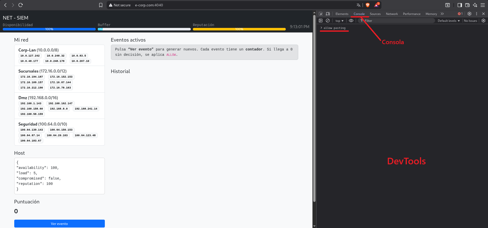
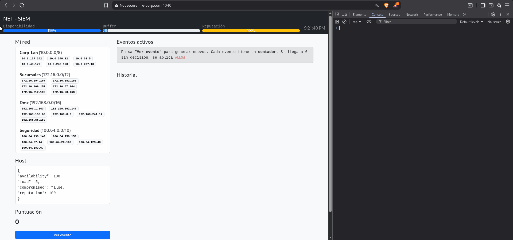

# E0488 Toolset

Conjunto de scripts de automatización para Blue Teamear como un desgraciado, procesando eventos de seguridad de forma automática.

## Componentes

- **DefenderGOD_v2.js**: Script de JavaScript que se ejecuta en el navegador a través de la consola de la DevTools. Detecta automáticamente los tipos de eventos, toma decisiones basadas en reglas predefinidas y procesa múltiples eventos simultáneamente mediante el turbo motor incorporado. Se podría decir que es el Terranator de los scripts.
- **AutoTasker_GodMode_v1.js**: Parecido al otro pero mas lento ya que usa otra lógica. Se deja en segundo plano mientras va resolviendo el ejercicio.

Importante: ***No uses el script sin haverlo intentado antes por tu cuenta.***

## Cómo usar

### Paso 1: Acceder al servicio

- Para usar **AutoTasker_GodMode_v1.js**, accede a: *IP_Máquina:3030*.
- Para usar **DefenderGOD_v2.js**, accede a: *IP_Máquina:4040*.

### Paso 2: Empieza el Rumbling

1. **En Chrome/Edge:**
   - Presiona `F12` o `Ctrl+Shift+I` (Windows/Linux) / `Cmd+Option+I` (Mac)
   - O haz clic derecho → "Inspeccionar elemento".

2. **En Firefox:**
   - Presiona `F12` o `Ctrl+Shift+I` (Windows/Linux) / `Cmd+Option+I` (Mac)
   - O haz clic derecho → "Inspeccionar elemento".

3. **En Safari:**
   - Ve a Preferencias → Avanzado → "Mostrar menú Desarrollo en barra de menús"
   - Luego Presiona `Cmd+Option+I`.

### Paso 3: Permitir pegado de código

En la consola de desarrollador:

1. **Si es la primera vez:**
    - Normalmente el navegador solicita que escribas `allow pasting` y pulsar enter para habilitar la opción de pegado de código. Si no te permite ejecutar el script, busca cómo habilitar el uso de scripts en la consola de tu navegador.
    - En este caso usaré Brave (cualquier navegador basado en crhomium funciona de manera similar).

### Paso 4: Ejecutar el Script

1. **Copia todo el código** de DefenderGOD_v2.js o de AutoTasker_GodMode_v1.js.
2. **Pega en la consola** del navegador.
3. **Presiona Enter** para ejecutar.
4. **Sigue las instrucciones** para iniciar la resolución del ejercicio.

No tiene mas secreto: Consola, pegar el script, ejecutar el script desde el panel y obtener la flag.
